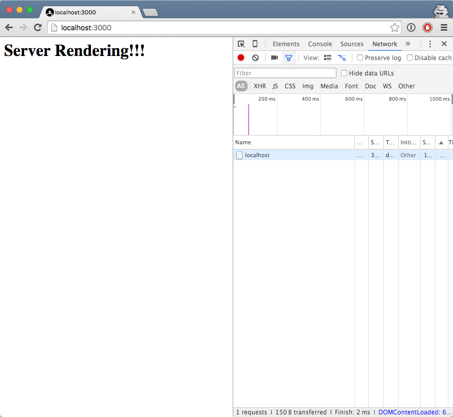
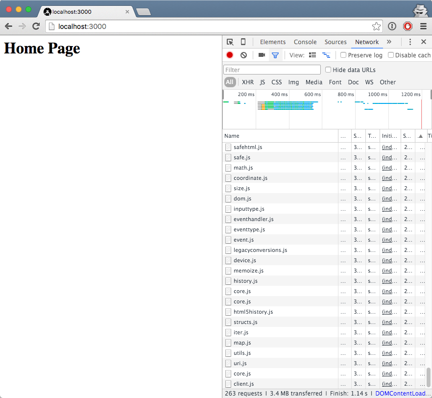
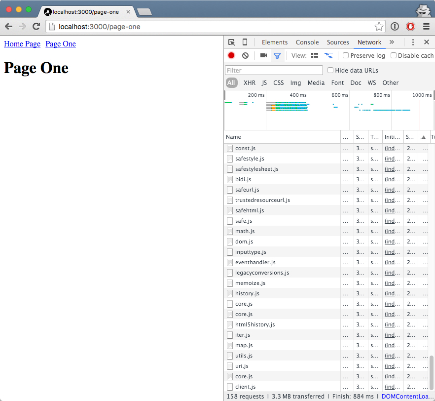
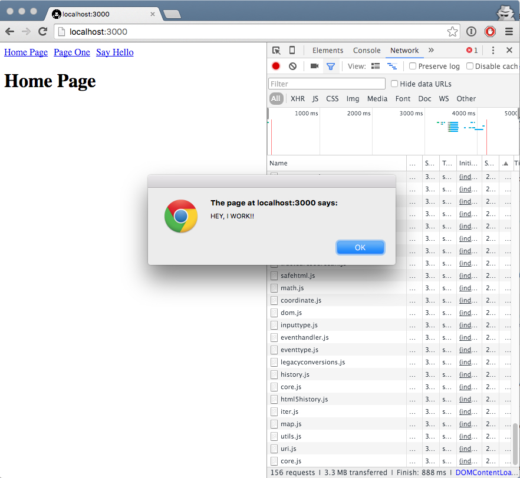

I've recently returned from [CodeMash 2.0.1.6](http://codemash.org) where I gave a talk entitled "Bringing the Power of Clojure to Node.js".  While preparing for it, I knew I wanted to show more real-world scenarios versus basic "Hello World" ones you can find many other places. I prepared a demo of an isomorphic ClojureScript application and below I'll share it in more detail than I could during the talk.

## What is Isomorphic ClojureScript?

Isomorphic ClojureScript is compiled Clojure targeting JavaScript where the same code runs on both the client and server.

## Benefits of an Isomorphic Approach
This approach has many benefits.  One huge one is what we already mentioned - code sharing.

With many Single Page Application-type architectures, when a user first hits the page, all of the assets have to download, usually taking several seconds.  While content is loading, the page is unrendered. A benefit of an isomorphic approach is that you get the performance of rendering on the server and you can render components after the page loads on the client.

## Creating an Isomorphic ClojureScript App

For this application, I'm going to assume that you already have Java (> 1.7.0), Leiningen (2.5.3) and Node.js (v5.4.1) already installed.

### Create New Project

Lets create a new project using Leiningen and the application template with `lein new app demo` which will set up the project structure below.

```
.
├── CHANGELOG.md
├── LICENSE
├── README.md
├── doc
│   └── intro.md
├── project.clj
├── resources
├── src
│   └── demo
│       └── core.clj
└── test
    └── demo
        └── core_test.clj
```
Since we'll be targeting Node.js, we need to add a package.json file at the project root.  Copy the code below and place it in the newly created file.  Take note of the Node.js version and the devDependencies. Only the current stable versions of Node.js are supported.  Node also has great source map support, and is enabled by adding a dev dependency.

```
{
  "name": "demo",
  "version": "0.1.0",
  "private": "true",
  "engines": {
    "node": "0.12.x"
  },
  "dependencies": {},
  "devDependencies": {
    "source-map-support": "0.4.0",
    "ws": "0.8.1"
  }
}
```

### Create an Express App

We'll be using Express as our Node.js web application framework.  Run the following command to install it.

`npm install express --save`

Now that it's installed, let's create a new server and a single route.  Create a new file `src-server/demo/server.cljs` and add the following code:

```
;src-server/demo/server.cljs

(ns demo.server
  (:require [cljs.nodejs :as nodejs]))

(nodejs/enable-util-print!)

(def express (nodejs/require "express"))

(defn say-hello! [req res]
  (.send res "Hello world!"))

(defn -main []
  (let [app (express)]
    (.get app "/" say-hello!)
    (.listen app 3000 (fn []
                        (println "Server started on port 3000")))))

(set! *main-cli-fn* -main)
```
Let's take a look at this file.  We declare a new namespace and require Node. We also include Express so that we can set up our server.  In the `-main` function, we set up a root route and when it's requested by the browser, call a function named `say-hello!` which returns the text "Hello World"

We have the code to start the server, but can't actually fire it up yet.  Let's do that next by configuring cljs-build. Open `project.clj` and add the following:

```
; project.clj

(defproject demo "0.1.0-SNAPSHOT"
  :description "FIXME: write this!"
  :url "http://example.com/FIXME"

  :min-lein-version "2.5.3"

  :dependencies [[org.clojure/clojure "1.7.0"]
                 [org.clojure/clojurescript "1.7.170"]]

  :plugins [[lein-cljsbuild "1.1.1"]]


  :clean-targets ^{:protect false} ["resources"]

  :cljsbuild {
    :builds [{:id "server"
              :source-paths ["src-server"]
              :compiler {
                :main demo.server
                :output-to "resources/public/js/server-side/server.js"
                :output-dir "resources/public/js/server-side"
                :target :nodejs
                :optimizations :none
                :source-map true}}]})

```
We add a new build named `server` and tell the compiler to output our compiled file to `resources/public/js/server-side/server.js`. Here we also specify the target of this build to Node by setting `:target :nodejs`.  The `:main demo.server-side` tells the compiler where to find the main function to call when starting the Node application.

Now that everything is wired up, let's test out this simple server and route. First, build the app by `lein cljsbuild once server`.  You should see that the output is placed where we set it in `project.clj`. Now, start up the Node application with `node resources/public/js/server-side/server.js`. The server should have started on port 3000.  Open up your browser to http://localhost:3000 and you should see "Hello World!" Congrats!  You have a working ClojureScript application running on Node.js!  

### Create a Server Rendered Page

We have our server up and running, but let's go even further by creating a server rendered page.  For this example, we'll be using [Reagent](http://reagent-project.github.io/), a minimalistic interface between ClojureScript and React.js.

In order to use Reagent, it's necessary to install React.js on the server side as well.  Install it by executing:

`npm install react react-dom --save`

and add Reagent to `project.clj`

  ```
  :dependencies [[org.clojure/clojure "1.7.0"]
                 [org.clojure/clojurescript "1.7.170"]
                 [reagent "0.6.0-alpha"]]
  ```


Change `src-server/demo/server.cljs` to require Reagent and call a function `handle-request` that will render a static page from the server side:

```
; src-server/demo/server.cljs

(ns demo.server
  (:require [cljs.nodejs :as nodejs]
            [reagent.core :as reagent]))

(nodejs/enable-util-print!)

(def express (nodejs/require "express"))

(defn template []
  [:html
   [:head
    [:meta {:charset "utf-8"}]
    [:meta {:name    "viewport"
            :content "width=device-width, initial-scale=1.0"}]]
   [:body
    [:div#app
      [:h1 "Server Rendering!!!"]]]])

(defn ^:export render-page [path]
  (reagent/render-to-static-markup (template)))

 (defn handle-request [req res]
   (.send res (render-page (.-path req))))

(defn -main []
  (let [app (express)]
    (.get app "/" handle-request)
    (.listen app 3000 (fn []
                        (println "Server started on port 3000")))))

(set! *main-cli-fn* -main)

```

You'll see that Reagent has a `render-to-static-markup` function that mirrors the React.js `ReactDOMServer.renderToStaticMarkup` function to render a static page. Also of note, Reagent uses a [Hiccup](https://github.com/weavejester/hiccup)-like syntax to describe the UI.

If you build (`lein cljsbuild once server`) and run the application (`node resources/public/js/server-side/server.js`) as before, you should see output similar to the image below.  Check out the network tab - there isn't any JavaScript sent to the client at this time.



## Create Client Side Application

We've increased performance by rendering the initial page on the server, now we'd like to render other components on the client side.  Let's create our client side application.

First, let's do some refactoring. Create a new namespace `(ns site.tools)` and move some functions from `(ns demo.server)` there.  

```
; src/site/tools.cljs

(ns site.tools
  (:require [reagent.core :as reagent :refer [atom]]))

(enable-console-print!)

(defn template []
  [:html
   [:head
    [:meta {:charset "utf-8"}]
    [:meta {:name    "viewport"
            :content "width=device-width, initial-scale=1.0"}]]
   [:body
    [:div#app
      [:h1 "Server Rendering"]]]])

(defn ^:export render-page [path]
  (reagent/render-to-static-markup (template)))

```

```
; src-server/demo/server.cljs

(ns demo.server
  (:require [cljs.nodejs :as nodejs]
            [site.tools :as tools]))

(nodejs/enable-util-print!)

(def express (nodejs/require "express"))

(defn handle-request [req res]
 (.send res (tools/render-page (.-path req))))

(defn -main []
  (let [app (express)]
    (.get app "/" handle-request)
    (.listen app 3000 (fn []
                        (println "Server started on port 3000")))))

(set! *main-cli-fn* -main)
```

Next, we'll need to add [Secretary](https://github.com/gf3/secretary) for basic client side routing and dispatch as well as [Pushy](https://github.com/kibu-australia/pushy) for HTML5 push state.

```
; project.clj

:dependencies [[org.clojure/clojure "1.7.0"]
                 [org.clojure/clojurescript "1.7.170"]
                 [reagent "0.6.0-alpha"]
                 [secretary "1.2.3"]
                 [kibu/pushy "0.3.1"]]
```

Now, let's create some client side markup.  We'll define a default route, a Reagent atom to keep state, a function `app-view` that we'll call to determine the page requested, and some basic markup to display for that page.

```
;src/demo/core.clj

(ns demo.core
  (:require [reagent.core :as reagent :refer [atom]]
            [secretary.core :as secretary :refer-macros [defroute]]
            [goog.events :as events]
            [goog.history.EventType :as EventType])
  (:import goog.History))

(def current-page (atom nil))

(defn home-page []
  [:div [:h1 "Home Page"]])

(defn app-view []
  [:div [@current-page]])

(secretary/set-config! :prefix "/")

(defroute "/" []
  (.log js/console "home page")
  (reset! current-page home-page))

; the server side doesn't have history, so we want to make sure current-page is populated
(reset! current-page home-page)

```

In our server side template, we've previously defined a div with the id `app` to use for our client side application render to.  We have just created some basic markup for it, but now we need to actually render the markup.  Create a new namespace where we'll use Reagent to render a component to the div.  You'll see we call the `app-view` function from here to render the markup for the page requested.

```
; src-client/demo/client.cljs

(ns demo.client
  (:require [reagent.core :as reagent :refer [atom]]
            [secretary.core :as secretary :refer-macros [defroute]]
            [pushy.core :as pushy :refer [push-state!]]
            [demo.core :as core])
  (:import goog.History))

(enable-console-print!)

(reagent/render-component [core/app-view] (.getElementById js/document "app"))

(push-state! secretary/dispatch!
  (fn [x] (when (secretary/locate-route x) x)))

```

Next, we'll change our `render-page` function to dispatch the default client route and render the home page markup on initial page load.

```
(ns site.tools
  (:require [reagent.core :as reagent :refer [atom]]
            [secretary.core :as secretary :refer-macros [defroute]]
            [demo.core :as core]))

(enable-console-print!)

(defn template [{:keys [body]}]
  [:html
   [:head
    [:meta {:charset "utf-8"}]
    [:meta {:name    "viewport"
            :content "width=device-width, initial-scale=1.0"}]]
   [:body
    [:div#app [body]]
    [:script {:type "text/javascript"
              :dangerouslySetInnerHTML {:__html "goog.require('demo.client');"}}]]])

(defn ^:export render-page [path]
  (reagent/render-to-static-markup (do
                                     (secretary/dispatch! path)
                                     (template {:body core/app-view}))))

```

We've created our client side application, and now we need to compile it and output it to a location.  We'll add a new build configuration named `app` for this.

```
:cljsbuild {
    :builds [{:id "server"
              :source-paths ["src" "src-server"]
              :compiler {
                :main demo.server
                :output-to "resources/public/js/server-side/server.js"
                :output-dir "resources/public/js/server-side"
                :target :nodejs
                :optimizations :none
                :source-map true}}
             {:id "app"
              :source-paths ["src" "src-client"]
              :compiler {
                :output-to "resources/public/js/app.js"
                :output-dir "resources/public/js"
                :optimizations :none
                :source-map true}}]}
```

Check out the `:source-paths` section of each build.  You'll see that we've separated the server and client code as well as included shared code in each build. This is typical of an isomorphic app where code runs on both the client and server.

Because we've built these separately, as it stands now, the server has no idea that there's client side code.  We'll need to tell Express to serve up the location of where to find the client side code.  We'll use an NPM module called [serve-static](https://github.com/expressjs/serve-static) to do this. Require the module in `demo.server` and tell Express to create a route that matches the output directory specified in the build configuration.

`npm install serve-static --save`


```
;src-server/demo/server.cljs

(ns demo.server
  (:require [cljs.nodejs :as nodejs]
            [demo.core :as core]
            [site.tools :as tools]))

(nodejs/enable-util-print!)

(def express (nodejs/require "express"))
(def serve-static (nodejs/require "serve-static"))

(defn handle-request [req res]
 (.send res (tools/render-page (.-path req))))

(defn -main []
  (let [app (express)]
    (.get app "/" handle-request)
    (.use app (serve-static "resources/public/js"))
    (.listen app 3000 (fn []
                        (println "Server started on port 3000")))))

(set! *main-cli-fn* -main)

```

Next, add a script tag to include the compiled client side code.

```
;src/site/tools.cljs
(defn template [{:keys [body]}]
  [:html
   [:head
    [:meta {:charset "utf-8"}]
    [:meta {:name    "viewport"
            :content "width=device-width, initial-scale=1.0"}]]
   [:body
    [:div#app [body]]
    [:script {:type "text/javascript" :src "goog/base.js"}]
    [:script {:type "text/javascript" :src "app.js"}]
    [:script {:type                    "text/javascript"
              :dangerouslySetInnerHTML {:__html "goog.require('demo.client');"}}]]])


```

We've finally got everything wired up. `lein cljsbuild once app server` and `node resources/public/js/server-side/server.js`.  You should see "home page" output to both the browser and server consoles.



Now we could totally stop here because we have a functioning isomorphic application, but lets add some other goodies.

Add a new client side route and some navigation to `(ns demo.core)`.

```
;src/demo/core.cljs

(ns demo.core
  (:require [reagent.core :as reagent :refer [atom]]
            [secretary.core :as secretary :refer-macros [defroute]]
            [goog.events :as events]
            [goog.history.EventType :as EventType])
  (:import goog.History))

(def current-page (atom nil))

(defn navigation []
  [:div [:a {:href "/"} "Home Page"]
   [:span {:style {:padding "5px"}}]
   [:a {:href "/page-one"} "Page One"]
   [:span {:style {:padding "5px"}}]])

(defn home-page []
  [:div [navigation] [:h1 "Home Page"]])

(defn page-one []
  [:div [navigation] [:h1 "Page One"]])

(defn app-view []
  [:div [@current-page]])

(secretary/set-config! :prefix "/")

(defroute "/" []
  (.log js/console "home page")
  (reset! current-page home-page))

  (defroute "/page-one" []
    (.log js/console "page-one")
    (reset! current-page page-one))

; the server side doesn't have history, so we want to make sure current-page is populated
(reset! current-page home-page)

```

Build both the app and server then fire up the Node application once again. You'll see the home page along with the new navigation. Click "Page One".  You'll see "Page One" in browser console, but not in server console. All is now rendering client side.



Now for a little fun and to show off some basic JavaScript interop, let's add an alert.

```
;src/demo/core.cljs

...

(defn navigation []
  [:div [:a {:href "/"} "Home Page"]
   [:span {:style {:padding "5px"}}]
   [:a {:href "/page-one"} "Page One"]
   [:span {:style {:padding "5px"}}]
   [:a {:href "#" :on-click #(js/alert "HEY, I WORK!!")} "Say Hello"]])

...

```

Rebuild the app and server and start the app once more.



## Next Steps

 I feel that the future is bright for ClojureScript. Its story fits really well with the problems most developers are facing today - especially in the dawn of the React era. I hope that this demo has shown you ClojureScript's simplicity along with the power it can provide.

 The complete application can be found on [GitHub](https://github.com/andrewvida/isomorphic-clojurescript-reagent-node).
